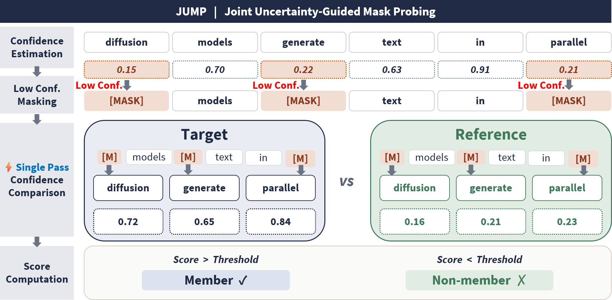

<div align="center">

# JUMP

**Minimal code for PRISM-selected multi-mask membership inference on diffusion language models.**

<a href="./overview.pdf">
  
</a>

[Overview PDF](./overview.pdf)

</div>

---

## What is this?

JUMP is a lightweight research code bundle for evaluating membership inference attacks on diffusion language models. It includes the core code to:

- train a PRISM selector on top of an LLaDA backbone,
- select high-signal clean tokens,
- run the JUMP multi-mask attack,
- report attack metrics and diagnostics.

This repository intentionally keeps only the minimal attack/training code needed for reproduction.

## Setup

Install the dependencies in the same environment used for LLaDA experiments:

```bash
pip install torch transformers accelerate numpy scikit-learn
```

LLaDA checkpoints, tokenizers, PRISM checkpoints, and evaluation manifests are not bundled. Pass them through the CLI arguments below.

## Train PRISM

Skip this step if you already have a PRISM checkpoint.

```bash
python jump/train_prism.py \
  --base-model GSAI-ML/LLaDA-8B-Base \
  --tokenizer-path external/llada_8b_base_tokenizer \
  --train-text-path path/to/train.jsonl \
  --out-dir outputs/prism \
  --epochs 1 \
  --batch-size 4 \
  --grad-accum 2 \
  --max-length 256 \
  --lr 1e-4 \
  --lora-rank 16 \
  --lora-alpha 16 \
  --lora-dropout 0.1
```

Main output:

```text
outputs/prism/checkpoint_best.pt
outputs/prism/summary.json
```

## Run JUMP

```bash
python jump/eval_jump.py \
  --model_path GSAI-ML/LLaDA-8B-Base \
  --tokenizer_path external/llada_8b_base_tokenizer \
  --target_model_path path/to/target/checkpoint-80 \
  --prism_checkpoint outputs/prism/checkpoint_best.pt \
  --target_backbone path/to/target/checkpoint-80 \
  --reference_backbone none \
  --eval_data path/to/eval_manifest.json \
  --output_dir results/jump_eval \
  --selected_k 64 \
  --selection_mode quality_bot \
  --batch_size 8 \
  --bf16 \
  --fixed_huber_clip_values 0.4054651081081644
```

Typical setting:

```text
selection_mode = quality_bot
selected_k      = 64
aggregation     = clipped mean target/reference gap
clip value      = log(1.5)
```

## Expected inputs

`eval_jump.py` expects an evaluation manifest in the existing `sample_groups` format, with member and non-member examples already defined.

## Outputs

The evaluator writes results under `--output_dir`, including:

- `summary.json`
- per-feature metrics
- optional selector/sample diagnostics

## Repository layout

```text
jump/
├── eval_jump.py              # attack evaluation entrypoint
├── train_prism.py            # PRISM training entrypoint
├── core/
│   ├── attack/               # JUMP scoring, masking, aggregation, runner
│   ├── selection/            # selector features and diagnostics
│   ├── training/             # PRISM training pipeline
│   ├── shared/               # metrics, manifests, model loading
│   └── prism_utils.py        # PRISM head, LoRA, checkpoint helpers
├── overview.pdf
└── README.md
```

## Notes

- Top-level scripts are intentionally short wrappers around `jump.core` modules.
- Paths to model checkpoints, tokenizers, and manifests must be supplied by the user.
- `overview.png` should be placed at the repository root so the figure renders at the top of this README.
